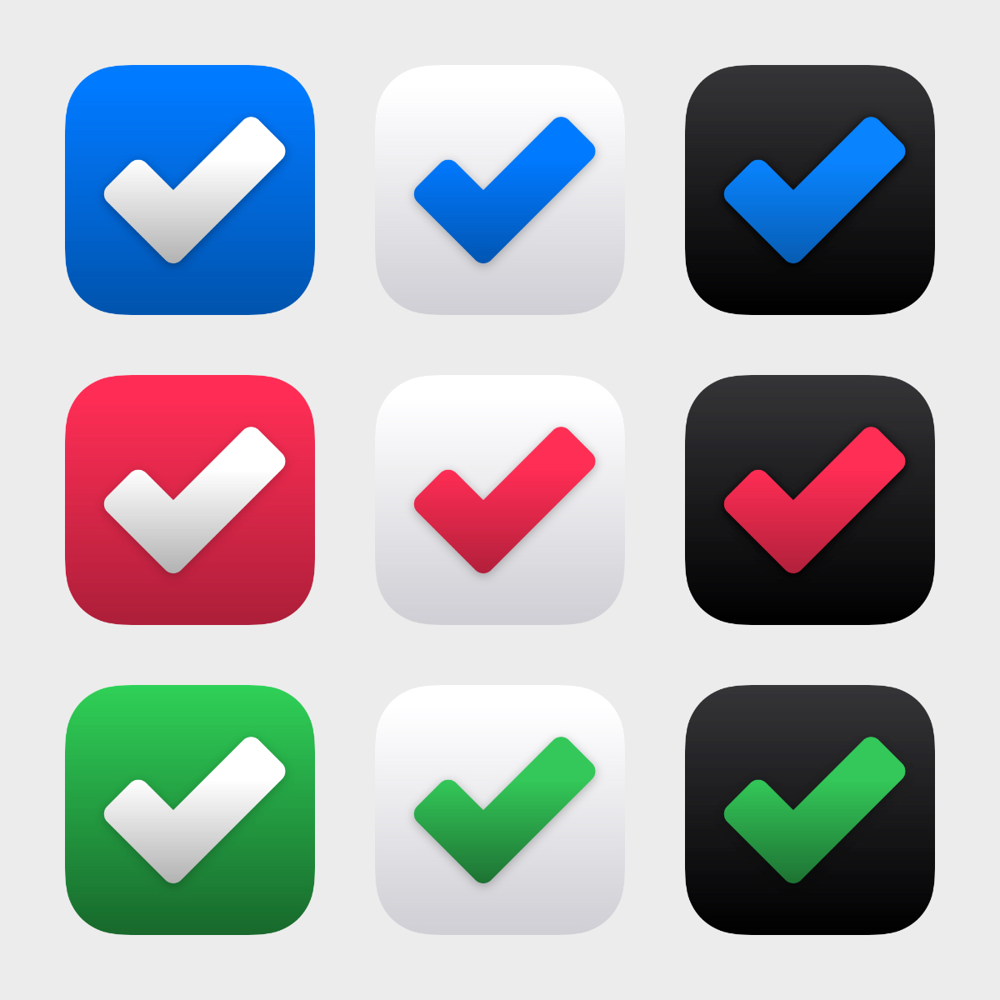

# SwiftUI 2 - Devote
 

  

  Let’s build together another outstanding iOS and iPadOS app with SwiftUI! The new project will be a TODO application with Core Data.

## Topics are covered:

- [x] How to build an impressive Todo iOS and iPadOS application
- [x] How to save data permanently to the local database with Core Data
- [x] How to add priority for the Todo items
- [x] How to delete Todo items
- [x] How to create an outstanding Home view with custom illustrations and quotes
- [x] How to build a complex Settings view
- [x] How to develop a new feature: Alternative Icons
- [x] How to develop a new feature: App Color Themes
- [x] How to open external links like Web pages, Twitter app, etc.
- [x] How to create a subtle animation and enhance the UX
- [x] How to support Dark/Light user interface

## What is Alternate iOS App Icon?

 Learn how to dynamically change app icons in your iOS apps. Every app needs a beautiful and memorable icon that attracts attention in the App Store and stands out on the Home screen. Your icon is the first opportunity to communicate, at a glance, your app’s purpose. It also appears throughout the system, such as in Settings and search results.

  

App customization is a feature that evokes a personal connection and enhances user experience. If it provides value in your app, you can let people select an alternate app icon from a set of predefined icons that are embedded within your app.

## Meta

Tin Tran – [Linkedin](https://www.linkedin.com/in/realtrantrungtin) – realtrantrungtin@gmail.com
